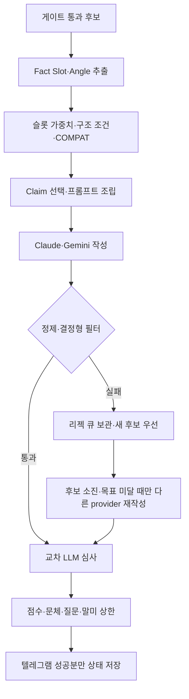

# 페르소나별 게시글 생성 프로세스

| 기준 | 내용 |
|---|---|
| 기준일 | 2026-09-12 KST |
| 기능 기준 | `9fca3af` |
| 적용 범위 | 후보가 생성 단계에 진입한 뒤 Persona·Angle 선택부터 텔레그램 배포 판정까지 |

## 1. 점검 결론

- 현재 구조는 **통합 Persona 10종 × 데이터 기반 Angle 11종**입니다. 110개는 원시 조합
  공간이며, 실제 생성은 슬롯 가중치·Fact Slot·`COMPAT`을 모두 통과한 조합만 사용합니다.
- 페르소나는 말투만 정하지 않습니다. 문장 수, 길이, 숫자 목표, 질문 허용 여부,
  문장 구조를 함께 소유합니다. Angle은 게시글이 전달할 정보 하나를 정합니다.
- 이번 점검에서 실발송으로 확인된 `quick_memo × context` 같은 계약 밖 조합이 생길 수 있는
  런타임 우회와 `짧은메모`의 숫자 지시 충돌을 수정했습니다.
- 다음 실행부터 `run_stats.jsonl.by_persona`에 페르소나별 시도·필터 통과·보류·발송·
  평균 점수·Angle 분포가 기록됩니다.
- `term_guide`는 정의돼 있지만 현재 운영 소스가 `용어 설명:` 필드를 만들지 않아 사실상
  휴면 상태입니다. 검증된 용어 사전을 입력에 붙이기 전에는 억지로 활성화하지 않습니다.

## 2. 전체 흐름

| 단계 | 실제 코드 | 동작 |
|---:|---|---|
| 1 | `gate.py`, `angles.available()` | 글감과 사용 가능한 Angle이 없는 후보를 LLM 호출 전에 차단 |
| 2 | `facts.slots()`, `facts.count()` | 글자 수가 아니라 독립 사실 계열을 최대 2개씩 인정해 정보량 계산 |
| 3 | `generator.pick_style()` | 슬롯 가중치에서 구조 조건과 Persona×Angle 호환성을 통과한 페르소나 선택 |
| 4 | `claims.select()` | Angle 우선순위와 항목별 고정 seed로 이번 글에 쓸 주장만 최대 3~5개 선택 |
| 5 | `personas.build_messages_v2()` | 선택 밖 사실을 제거하고 Persona·Angle·금지 규칙을 하나의 프롬프트로 조립 |
| 6 | `generator._run()` | 슬롯별 temperature로 Claude·Gemini 작성 후 정규화 |
| 7 | `filters.check()` | 길이·질문·숫자·근거·derived fact·문법·준법 위반을 결정형으로 검사 |
| 8 | `generator.generate()`, `retry_rejected()` | 리젝 글을 보관하고 새 후보를 모두 쓴 뒤 목표 미달일 때만 다른 provider로 한 번 재생성 |
| 9 | `judge.judge_all()` | 작성 모델과 다른 모델이 6축 점수와 fatal 위반을 심사 |
| 10 | `decide.decide_distribution()` | 사실성·준법성·fit·총점과 종목/유형/페르소나/질문/말미 상한 적용 |

`tone`, `fmt`, `length` 필드에 같은 Persona ID가 반복 저장되는 것은 v1 호출부와 데이터의
하위 호환을 유지하기 위한 것입니다. 현재 의미상 단일 축이며 새 Voice·Format·Length 축이 아닙니다.

## 3. 페르소나별 계약

`주장 상한`은 문장 수에서 계산하며 최대 5개입니다. `프롬프트 숫자 목표`는 모델에 주는
더 보수적인 지시이고, 결정형 검수는 한 주장에 숫자가 둘 포함될 수 있어 별도 여유를 둡니다.

| ID / 표시명 | 분량 | 주장 상한 | 질문 | 선택 전제 | 핵심 역할 |
|---|---:|---:|---|---|---|
| `brief_report` / 속보 | 3문장, 45~150자 | 3 | 금지 | 독립 사실 1개 이상 | 종목명으로 시작해 사실과 배경만 짧게 전달 |
| `fact_note` / 사실정리 | 4~5문장, 80~240자 | 5 | 금지 | 사실 2개 이상; 장문 정책 요지는 예외 | 확인된 사실을 순서대로 정리 |
| `term_guide` / 용어해설 | 5~6문장, 110~280자 | 5 | 금지 | 사실 2개 이상 + `용어 설명:` | 입력에 제공된 정의 하나만 풀이 |
| `data_focus` / 수치중심 | 4문장, 70~200자 | 4 | 금지 | 사실 2개 이상 + 비교·수급 파생값 | 계산하지 않고 코드가 만든 비교값 전달 |
| `careful_note` / 신중 | 5문장, 100~260자 | 5 | 금지 | 사실 2개 이상 | 방향·폭을 그대로 전하고 완충 표현 제한 |
| `two_view` / 양면 | 5~6문장, 110~280자 | 5 | 금지 | 사실 2개 이상 + 상반 관찰쌍 | 양쪽 근거를 나란히 두되 결론·전망 금지 |
| `check_list` / 확인포인트 | 4~5문장, 90~240자 | 5 | 허용 | 사실 2개 이상 | 조건·금액·시점을 문장으로 점검 |
| `quick_memo` / 짧은메모 | 2~3문장, 55~120자 | 3 | 금지 | 사실 1개 이상 + 공시 슬롯 | 핵심 사실만 짧게 전달; 비공시 슬롯은 비활성 |
| `timeline_note` / 시간순 | 4~5문장, 90~240자 | 5 | 금지 | 사실 2개 이상 + 날짜 앵커 2개 이상 | 입력 시점을 시간순으로 전달 |
| `open_talk` / 발제 | 4문장, 80~220자 | 4 | 허용 | 사실 2개 이상 | 입력 사실을 특정한 질문; 리서치에서는 비활성 |

추가 구조 조건:

- `two_view`는 단순히 수치가 둘 있다는 이유로 선택되지 않습니다. 상승과 고가 대비 하락,
  상승과 순매도처럼 코드가 찾은 상반 관찰쌍이 있어야 합니다.
- `data_focus`는 평균 대비 배수·5거래일 누적·장중 범위·수급·공매도 중 하나가 있어야 합니다.
- `timeline_note`는 `5거래일 누적` 하나를 두 시점으로 오인하지 않고 실제 날짜 앵커를 셉니다.
- 모든 정상 후보가 정보량 조건에서 꺼지면, 해당 슬롯에서 활성화됐고 Angle과 호환되는
  페르소나 중 최소 길이가 가장 짧은 것을 선택합니다. 호환 Angle도 없으면 일반 초점으로
  폴백하며 계약 밖 Angle을 억지로 붙이지 않습니다.

## 4. 슬롯별 기본 가중치

`3=추천`, `2=보통`, `1=낮은 확률`, `—=비활성`입니다. 실제 선택 때는 위 구조 조건과
호환성 검사를 한 번 더 적용하므로 아래 숫자가 곧 최종 비율은 아닙니다.

| Persona | 공시 | 리서치 | 특징주 | 정책 | 발제 | 테마 |
|---|---:|---:|---:|---:|---:|---:|
| 속보 | 2 | 2 | 3 | 1 | — | 1 |
| 사실정리 | 3 | 3 | 2 | 2 | — | 2 |
| 용어해설 | 3 | 2 | 1 | 3 | — | 3 |
| 수치중심 | 2 | 2 | 3 | — | — | — |
| 신중 | 2 | 2 | 2 | 2 | — | 2 |
| 양면 | 1 | 3 | 1 | 3 | — | 3 |
| 확인포인트 | 3 | 2 | 1 | 3 | — | 2 |
| 짧은메모 | 1 | — | — | — | — | — |
| 시간순 | 2 | 1 | 1 | 2 | — | 1 |
| 발제 | 1 | — | 2 | 2 | 3 | 2 |

- 리서치 `open_talk`는 적정가격·투자의견에 대한 투자판단 질문이 반복돼 비활성화했습니다.
- 발제 슬롯은 질문 계약과 충돌하지 않도록 `open_talk`만 허용합니다.
- 정책·테마는 수치가 없는 경우가 많아 `data_focus`를 비활성화했습니다.
- `quick_memo`는 실측 9건에서 정보량 부족으로 전멸해 공시에서만 제한적으로 사용합니다.

## 5. Angle과 Claim 연결

| Angle | 필요한 입력 | 우선 Claim | 주의점 |
|---|---|---|---|
| `reaction` | 등락률 | 등락률→종가→거래대금 | 원인 추정 금지 |
| `compare` | 평균·5거래일·장중 비교 | 거래량 배수→누적→고저차→마감위치 | 비교 대상과 값 함께 사용 |
| `amount` | 원·억원·조원 | 발행/계약금액→규모비교→거래대금 | 금액이 무엇인지 명시 |
| `ratio` | 비율·배수 | 합병/배정비율→규모비교→지분·배수 | 크기 평가 금지 |
| `duration` | 만기·기간·시행·예정일 | 만기/예정일→누적→사건 | 날짜 계산 금지 |
| `terms` | 전환가액·이율·배정·투자의견 | 조건값→상대방→투자의견·적정가격 | 리포트 발간사를 주어로 명시 |
| `purpose` | 자금·취득·합병 목적 | 목적→계약내용→상대방→금액 | 회사 의도 추정 금지 |
| `decode` | `용어 설명:` | 정의→사건→계약내용 | 일반 지식으로 정의 생성 금지 |
| `context` | 검증된 사업·산업 내용 | 사업내용→정책요지→사건 | 상식으로 배경 보충 금지 |
| `inquiry` | 조회공시·답변 성격 | 답변→사건→등락 | 미확정 답변 이상의 추정 금지 |
| `uncertainty` | 실제 미제공·미확인 필드 | 사건→등락 | 전체 약 10% 이내, 부재 자체가 논점일 때만 |

Claim은 모델이 고르지 않습니다. `claims.select()`가 Angle 우선순위로 고른 목록만 시스템
프롬프트와 사용자 facts 양쪽에 남기며, 선택 밖 숫자·비수치 주장 사용은 필터가 차단합니다.

## 6. 생성 후 품질 방어

| 관문 | 페르소나 관련 검사 |
|---|---|
| 정제 | 자기소개·체크리스트 누출 제거, 기사체 상투어 및 실측 비문을 의미 보존 범위에서 수정 |
| 길이 | 각 페르소나의 최소·최대 글자 수 적용 |
| 완결 | 문장 중간 절단, `~는데요.`·`~인데요.` 연결어미 종결 차단 |
| 질문 | `no_question=True`는 질문 마무리 차단; poll은 `?` 종결 강제 |
| 사실 | 미선정 Claim, 입력 밖 숫자·기간 계산, 방향 오용, 무근거 정의·배경 차단 |
| 정보가치 | 유의미한 derived fact가 있으면 값과 비교 문맥을 함께 사용해야 통과 |
| 재생성 | 새 원본 후보를 먼저 쓰고, 후보 소진 뒤 목표 미달일 때만 오류 힌트와 함께 다른 provider로 한 번 재생성 |
| 심사 | factual·useful·natural·compliant·gain·fit 6축; 미심사·fatal은 fail-closed |
| 배포 다양성 | 페르소나당 최대 목표의 30%, 질문형 최대 10%, 동일 말미 최대 2건 |

## 7. 실발송 관찰값

아래 60건은 2026-09-12 테스트방의 `50 + 5 + 5` 실발송 합계입니다. 실행 사이에 코드가
수정됐으므로 현재 버전의 통제된 성능 비교가 아니라 **과거 실제 분포 기준선**입니다.

| Persona | 발송 건수 | 비중 |
|---|---:|---:|
| 속보 | 16 | 26.7% |
| 신중 | 13 | 21.7% |
| 수치중심 | 13 | 21.7% |
| 짧은메모 | 5 | 8.3% |
| 확인포인트 | 4 | 6.7% |
| 양면 | 4 | 6.7% |
| 사실정리 | 3 | 5.0% |
| 발제 | 2 | 3.3% |
| 용어해설 | 0 | 0.0% |
| 시간순 | 0 | 0.0% |

Angle은 `amount 18`, `ratio 18`, `reaction 13`, `compare 9`, `context 1`, `duration 1`건이었고
나머지는 0건이었습니다. 50건 본검증이 공시 4·특징주 46으로 편중돼 금액·비율·시세 Angle이
대부분을 차지했습니다. 최종 후속 5건에서는 정책 `fact_note × duration` 1건이 포함됐습니다.

이번 점검에서 잡은 런타임 우회는 과거 1차 후속 실발송의
`quick_memo × context` 1건으로 실제 확인됐습니다. 이 글은 두 날짜로부터 `약 6개월`을
직접 계산하기도 했습니다. 기간 계산은 `4d10905`, 조합 우회는 `fa39dff`에서 각각 차단했습니다.

## 8. 변경 이력

| 단계 | 문제 | 반영 내용 | 대표 커밋 |
|---:|---|---|---|
| 1 | 초기 톤·구조가 단순하고 공시 사실이 빈약 | DART 상세값, 페르소나 10종, 구조 확장 | `6b5a0d3` |
| 2 | Voice×Angle×Format×Length 조합이 서로 충돌 | Angle을 데이터 계약으로 전환하고 길이 축 분리 | `7120ebd`, `c1b60e2`, `87d306a` |
| 3 | Voice 라벨만 바꿔도 결과 문체가 같음 | 말투를 서술 계약으로 전환, 숫자·어미·재시도 힌트 보강 | `4efae19`, `afd37c8`, `977783f`, `e42ab55` |
| 4 | 독립 축을 늘릴수록 불가능한 조합 증가 | 말투·구조·길이를 통합한 Persona v2 10종으로 전환 | `ada9c56`, `058a780`, `9ef1616` |
| 5 | 글자 수가 사실량으로 오인되고 성립하지 않는 조합 생성 | Fact Slot, 상반 관찰쌍, Persona×Angle `COMPAT` 도입 | `91f3816`, `8534a1a` |
| 6 | 모델이 허용 사실을 모두 소비하고 금지 주장을 우회 | Positive Claim Grammar, 문장별 grounding, 코드 주도 Claim 선택 | `d7248e0`, `ec58b0c`, `ddf74fb`, `fc6627b`, `fc9e2bd` |
| 7 | 짧은 글 전멸·질문형 편중·프롬프트/필터 길이 불일치 | `quick_memo` 제한, 질문 10% 상한, 길이 하한 주입, 계약 감사 도구 | `22c25bc`, `db6d592`, `1110837`, `135ceb9`, `9c59bf4` |
| 8 | 사실 나열만으로 fit을 통과 | 관계 서술을 코드가 만든 derived fact 실제 사용으로 재정의 | `00b7032`, `66493fb`, `9848922` |
| 9 | 심사 장애·모델 장애·투표 계약 충돌 | 미심사 fail-closed, provider 격리·재할당, poll 질문형 제한 | `f722dfc`, `34bf6b1`, `793cd85` |
| 10 | 실발송에서 Gemini 절단·오판·날짜/문법 문제 | thinking 최소화, Sonnet 우선 심사, 품질 차단기, 캐시·문법 보정 | `f5fc225`, `4d10905`, `3e5abb9` |
| 11 | 런타임 호환 그래프 우회와 페르소나별 성과 미계측 | 선택 전 COMPAT 강제, 짧은메모 계약 정렬, `by_persona` 추가 | `fa39dff` |
| 12 | 필터 탈락분을 즉시 재작성해 새 후보보다 비싼 재호출을 우선 | fresh-first 리젝 큐, 최초 60·후속 10~60 동적 stage, stage별 통계 | `ac456f1`, `9fca3af` |

## 9. 검증 및 다음 관찰

| 검증 | 결과 |
|---|---:|
| 단위 회귀 | 334/334 |
| 설정·프롬프트 감사 | 실패 0 / 경고 0 |
| 계약 조합 감사 | 268개 조합 중 불가 0 |
| 런타임 표본 | 4,200회 선택 중 비호환 0 |
| E2E | 20/20 |

다음 실제 실행부터는 `by_persona`를 기준으로 판단합니다.

`attempted`는 재시도 API 호출 횟수가 아니라 페르소나 선택까지 간 후보 항목 수입니다.
`angles`는 결정형 필터를 통과한 글의 Angle 분포입니다.

1. `attempted→filter_passed`가 낮으면 해당 Persona 프롬프트·길이 계약 문제입니다.
2. `filter_passed→delivered`가 낮고 factual/compliant가 정상이면 소재 적합도 문제입니다.
3. `term_guide`가 0인 것은 현재 예상 동작입니다. 출처가 검증된 `용어 설명:` 생성 경로를
   만들기 전에는 가중치를 올리지 않습니다.
4. `timeline_note`도 계속 0이면 날짜가 실제로 둘 있는 입력 수와 duration/context Angle
   적격 건수를 함께 확인합니다.
5. 분포를 바꿀 때는 가중치부터 조정하지 말고, 실제 페르소나별 퍼널과 담당자 수정률을 먼저 봅니다.
